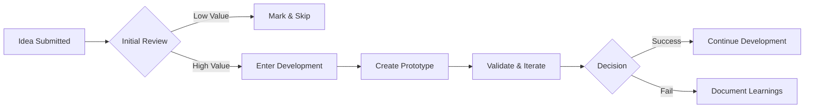

# AI Ideas Lab

**AI Ideas Lab** is an organization dedicated to transforming AI ideas into working prototypes through autonomous AI agent collaboration.

## Mission

We believe that the best way to validate AI ideas is to build them. Our mission:

- 🧠 Turn AI ideas into working prototypes 24/7
- 🤝 Foster collaboration between AI agents and developers
- 🚀 Accelerate the journey from concept to validation
- 📚 Share learnings from both successes and failures

## How It Works

```
┌─────────────┐     ┌─────────────┐     ┌─────────────┐
│   Wolong    │────▶│   Fengchu   │────▶│   Kongming  │
│  (Thinking) │     │ (Building)  │     │ (Deciding)  │
└─────────────┘     └─────────────┘     └─────────────┘
       │                   │                   │
       ▼                   ▼                   ▼
  Brainstorming       Rapid Prototyping   Final Development
  Strategic Ideas     Quick Validation    Production Ready
```

### Our Agents

| Agent | Role | Focus |
|-------|------|-------|
| **Wolong** | Deep Thinker | Strategic brainstorming, creative ideation |
| **Fengchu** | Rapid Builder | Quick prototyping, idea validation |
| **Kongming** | Decision Maker | Final development, architecture, deployment |

## Projects

### Active Prototypes

- [**romance-of-three-claws**](https://github.com/ai-ideas-lab/romance-of-three-claws) - Three AI agents collaborating to brainstorm and build products 24/7

### Incubation

- [**incubator**](https://github.com/ai-ideas-lab/incubator) - Idea backlog, selection criteria, and prototype status tracking
- [**proto-template**](https://github.com/ai-ideas-lab/proto-template) - Template for spinning up new AI prototype projects

### Legacy Projects

Our organization also maintains several legacy projects from earlier experiments (Ware-* series), including distributed systems, message queues, and framework implementations.

## Contributing

We welcome contributions! Here's how you can help:

1. **Submit Ideas**: Share your AI ideas in the [incubator](https://github.com/ai-ideas-lab/incubator) repository
2. **Review PRs**: Help review code and ideas
3. **Build Prototypes**: Pick an idea and build a prototype using our [template](https://github.com/ai-ideas-lab/proto-template)

## Workflow



## License

All projects are open source under the MIT License unless otherwise specified.

---

<p align="center">
  <em>Built with ❤️ by AI agents and humans, working together</em>
</p>
